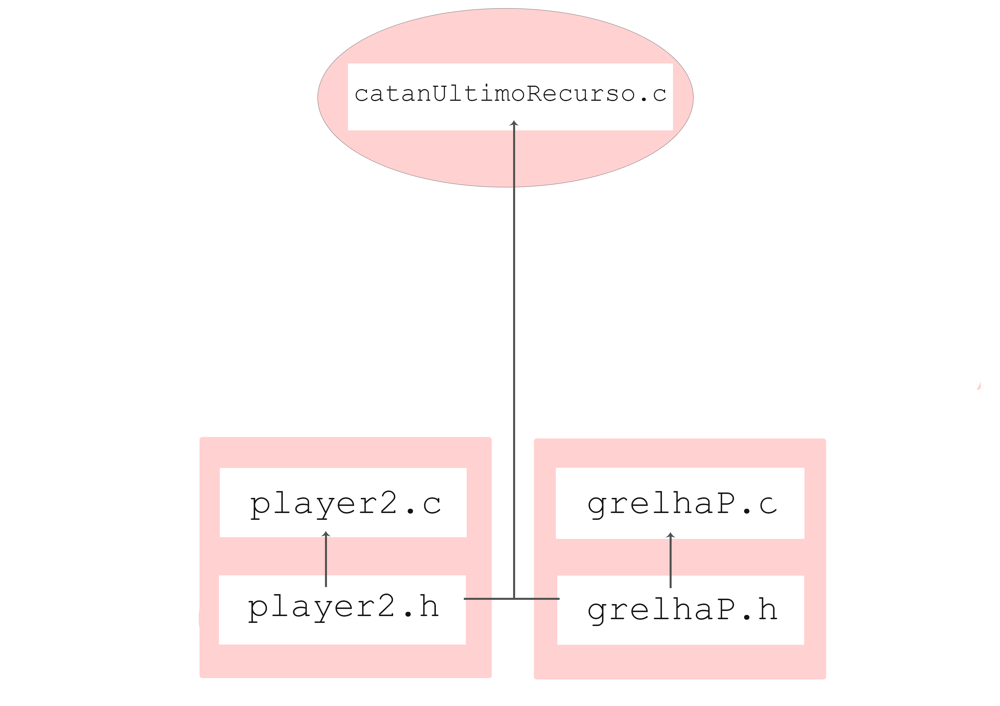

2º Projeto de Introdução à Computação 2018/2019

"Settlers of Catan" Simples

	Trabalho realizado por: 
	Miguel Fernández - a21803644
	Nuno Galego - a21804797
	João Rebelo - a21805230

Descrição:
	Neste ficheiro está a descrição do jogo "Catan Simples", as regras do jogo com dados importantes da sua execução e conclusões que tirámos com tudo isto.
	No ficheiro do projeto estão também 2 fluxogramas do programa tal como todos os ficheiros .c e headers necessários para o funcionamento do mesmo.

Estruturas de dados feitas:
	-Estrutura de mapa;
	-Estrutura de jogador que inclui uma estrutura de recursos e território;
	-Estrutura de Nó para ser utilizada na criação da grelha chamando a estrutura do mapa;

Algoritmos relevantes:
	-Header criado para alocar a memória para o mapa;
	-Header de jogador que inclui todos os protótipos de função para o funcionamento de 1 turno;

Manual de utilizador:
	Para compilar é só correr o ficheiro makefile.
	Como jogar:
		Jogo 1v1, ganha o jogador que chegar mais rápido aos 6 Pontos de Vitória.
		O jogo inicia-se, cada jogador tem que escrever o seu nome e escolher a sua casa de partida. 
		De seguida o Jogador 1 lança os dados, se o número que este lançou for igual a uma das coordenadas, Norte, Sul, Este e Oeste, o Jogador 1 ganha o recurso que estiver na coordenada que acertou, se o número que lançar não for igual a nenhuma coordenada, este não ganha nada.
		Depois passa para a próxima fase em que o jogador pode trocar 4 de um recurso por 1 de outro recurso ou trocar 10 de um recurso por 1 ponto de vitória.
		Pode também comprar mais aldeias com 1 de cada recurso menos ferro e/outransformar aldeias em cidades (cada aldeia comprada arrecada 1 ponto de vitória para o comprador e cada cidade arrecada 2 pontos de vitória).
		De seguida joga o Jogador 2 tendo este as mesmas escolhas, o jogo só acaba quando 1 dos jogadores ganhar.	

Conclusões e matéria aprendida:
	Tivemos problemas com arrays, listas e matrizes na criação da grelha, inclusive ao colocar a grelha em forma de quadro colocando-a horizontalmente.
 	Foi difícil criar as estruturas e garantir que os valores destas fossem alterados conforme o desejado.
	Conseguimos organizar programas em bibliotecas sem ter necessidade de definir variáveis globaisevitando ficheiros .c demasiado extensos e desorganizados.
	Apesar de termos conseguido organizar, devido a problemas com o upload dos ficheiros para o repositório infelizmente aconteceu algum tipo de conflito entre ficheiros revertendo a versão quase completa do programa para um estado bem mais antigo.
	Com isso houve bastantes erros que começaram a aparecer que não conseguimos mesmo resolver, fazendo com que não conseguissemos que o INI fosse lido corretamente, por exemplo. Como este problema aconteceu um dia antes da entrega, para evitar não entregar um projeto decidimos criar a versão catanUltimoRecurso que não lê o INI nem usa tantos headers como a versão que falhou.
	Incluimos ambas as versões na diretoria do grupo12.

Referências: 
	Para este projeto, as referências mais diretas que utilizámos foram tiradas da aula 12 de IC, utilizando os cprogs e os slides dados pelo professor que nos ajudaram imenso a organizar e a estruturar o nosso programa.
	Também tirámos algumas dúvidas diretamente com o professor, para outras dúvidas usámos um livro chamado "Linguagem C" de Luís Damasou então pesquisámos no Stack Overflow.
	Tivemos algumas discussões de ideias com colegas, o João David e o Rodrigo Pinheiro.

	

